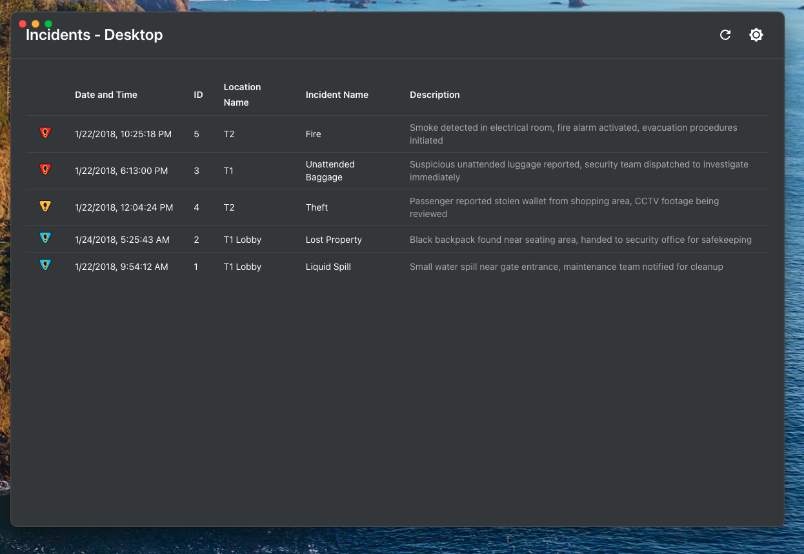
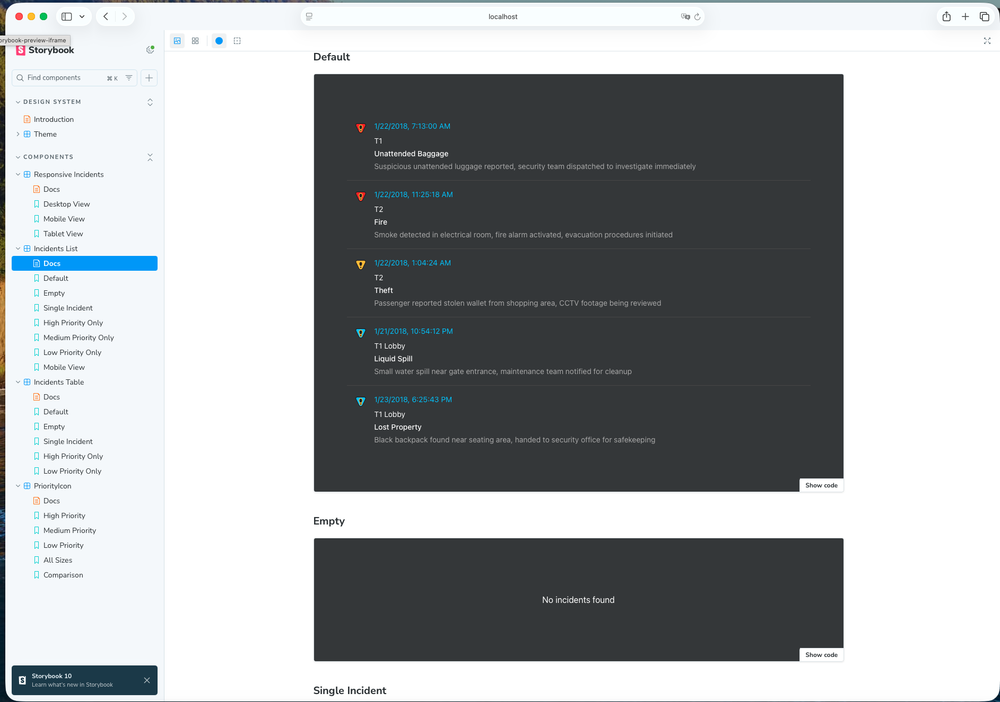

# Incident Management System

A production-ready, multi-platform incident management system built with React, React Native, and Electron. This monorepo contains a complete solution for tracking and managing incidents across web, mobile, and desktop platforms.

[](https://www.typescriptlang.org/)
[](https://reactjs.org/)
[](https://pnpm.io/)
[](LICENSE)

## Table of Contents

- [Features](#features)
- [Quick Start](#quick-start)
- [Project Structure](#project-structure)
- [Installation](#installation)
- [Development](#development)
- [Scripts Reference](#scripts-reference)
- [Mobile Development](#mobile-development)
- [Testing](#testing)
- [Building & Deployment](#building--deployment)
- [API Documentation](#api-documentation)
- [Troubleshooting](#troubleshooting)
- [Contributing](#contributing)

---

## Features

### Incident Management

- View all incidents with automatic duplicate filtering
- Sort by priority (High, Medium, Low) and date/time
- Display incident details including location and description
- Visual priority indicators with color-coded icons
- Responsive table/list view based on screen size

### Multi-Platform Support

- **Web**: Responsive web application (Vite + React)
- **Mobile**: iOS & Android apps (React Native + Expo)
- **Desktop**: Windows, macOS, Linux (Electron)
- **Code Sharing**: Maximum reuse across platforms

### User Experience

- **Dark/Light Mode**: Full theme support with system preference detection
- **Responsive Design**: Auto-switches between table (>600px) and list (<600px)
- **Accessibility**: WCAG compliant with proper ARIA labels
- **Performance**: Optimized rendering with TanStack Query caching
- **Real-time Updates**: Pull-to-refresh on mobile, refresh button on desktop

### Technical Excellence

- **Type Safety**: Full TypeScript coverage
- **Testing**: Comprehensive unit and integration tests
- **Monorepo**: Unified codebase with pnpm workspaces
- **Design System**: Material-UI based component library
- **Documentation**: Interactive Storybook for components

---

## Quick Start

### Prerequisites

- **Node.js** >= 18.0.0
- **pnpm** >= 8.0.0 (install: `npm install -g pnpm`)
- **Git**

**For mobile development:**

- **iOS**: Xcode 14+ (macOS only)
- **Android**: Android Studio + Android SDK

### One-Command Setup

```bash
# Clone the repository
git clone https://github.com/your-username/incident-management-system.git
cd incident-management-system

# Install all dependencies
pnpm install

# Start everything at once (auto-build shared packages)
pnpm start             # Recommended (works on all platforms)
# OR
node scripts/start-all.mjs     # Direct Node.js execution
```

This launches:

- Web App → http://localhost:3000
- API Server → http://localhost:3001
- Desktop App → Electron window
- Mobile App → Expo DevTools
- Storybook → http://localhost:6006 (optional)

### Quick Commands

```bash
# Individual apps
pnpm dev:web           # Web app only
pnpm dev:api           # API server only
pnpm dev:desktop       # Desktop app only
pnpm dev:mobile        # Mobile (Expo) dev server from root
pnpm dev:mobile:ios    # iOS simulator (macOS only, from root)
pnpm dev:mobile:android# Android emulator (from root)

# Mobile (in apps/mobile directory)
cd apps/mobile
pnpm start            # Expo dev server
pnpm web              # Web preview (recommended for testing)
pnpm ios              # iOS simulator (macOS only)
pnpm android          # Android emulator
```

---

## Project Structure

```
incident-management-system/
├── apps/
│   ├── web/                    # Vite + React Web App
│   │   ├── src/
│   │   │   ├── components/     # React components
│   │   │   │   └── Incidents/  # Main incidents component
│   │   │   ├── pages/          # Page components
│   │   │   └── test/           # Test utilities
│   │   └── vite.config.ts
│   │
│   ├── mobile/                 # React Native Mobile App
│   │   ├── src/
│   │   │   ├── screens/        # Screen components
│   │   │   └── App.tsx
│   │   ├── android/            # Android native code
│   │   ├── ios/                # iOS native code
│   │   ├── metro.config.js     # Metro bundler config (monorepo support)
│   │   └── index.js            # App entry point
│   │
│   ├── desktop/                # Electron Desktop App
│   │   ├── src/
│   │   ├── main.js             # Electron main process
│   │   └── preload.js          # Preload script
│   │
│   └── api/                    # Next.js API Backend
│       └── src/
│           └── pages/api/      # API endpoints
│               ├── incidents/
│               └── locations/
│
├── packages/
│   ├── shared/                 # Shared Business Logic
│   │   └── src/
│   │       ├── api/            # API clients & services
│   │       ├── hooks/          # React hooks (useIncidents)
│   │       ├── store/          # Zustand stores
│   │       ├── types/          # TypeScript types
│   │       └── utils/          # Utility functions
│   │
│   └── design-system/          # UI Component Library
│       └── src/
│           ├── components/     # Reusable UI components
│           ├── theme/          # Theme configuration
│           └── stories/        # Storybook stories
│
├── scripts/
│   └── start-all.mjs           # Cross-platform launch script (Node.js)
├── package.json                # Root package.json
├── pnpm-workspace.yaml         # pnpm workspace config
├── tsconfig.base.json          # Base TypeScript config
└── README.md                   # This file
```

---

## Installation

### Step 1: Install Dependencies

```bash
# Install pnpm if you haven't
npm install -g pnpm

# Install all project dependencies
pnpm install
```

### Step 2: Build Shared Packages

```bash
# Build shared packages (required before first run)
pnpm --filter @incident-system/shared build
pnpm --filter @incident-system/design-system build

# Or build all packages at once
pnpm -r --filter "./packages/**" build
```

### Step 3: Environment Setup (Optional)

Create `.env` files if needed:

```bash
# apps/api/.env
API_PORT=3001
NODE_ENV=development

# apps/web/.env
VITE_API_URL=http://localhost:3001
```

---

## Development

### Technology Stack

**Core:**

- TypeScript 5.3
- pnpm 8.15
- Monorepo Architecture

**Frontend:**

- React 18.3
- Vite (web)
- Material-UI (MUI)
- Emotion (styling)

**Mobile:**

- React Native 0.76
- Expo 52.0
- React Native Paper

**Desktop:**

- Electron
- electron-builder

**Backend:**

- Next.js
- RESTful API

**State & Data:**

- Zustand (state management)
- TanStack Query (server state)
- date-fns (date utilities)

**Testing:**

- Vitest
- React Testing Library
- Jest (React Native)

### Web Application

```bash
# Development
pnpm dev:web
# → http://localhost:3000

# Build for production
pnpm build:web
# → Output: apps/web/dist

# Preview production build
pnpm --filter @incident-system/web preview
```

### API Server

```bash
# Development
pnpm dev:api
# → http://localhost:3001

# Build for production
pnpm build:api
```

### Desktop Application

```bash
# Development
pnpm dev:desktop
# → Opens Electron window

# Build for production
pnpm --filter @incident-system/desktop build

# Build platform-specific packages
pnpm --filter @incident-system/desktop dist         # All platforms
pnpm --filter @incident-system/desktop dist -- --mac     # macOS only
pnpm --filter @incident-system/desktop dist -- --win     # Windows only
pnpm --filter @incident-system/desktop dist -- --linux   # Linux only
```



### Design System (Storybook)

```bash
# Start Storybook
pnpm --filter @incident-system/design-system storybook
# → http://localhost:6006

# Build static Storybook
pnpm --filter @incident-system/design-system build-storybook
```

**Storybook Features:**

- Browse all design system components
- Interactive component playground
- Dark/Light theme switching
- Responsive viewport testing
- Live prop controls
- Auto-generated documentation



---

## Scripts Reference

### Root-Level Scripts

| Script                    | Description                                                                             |
| ------------------------- | --------------------------------------------------------------------------------------- |
| `pnpm start`              | Start all applications (cross-platform)                                                 |
| `pnpm dev:web`            | Start web app only                                                                      |
| `pnpm dev:api`            | Start API server only                                                                   |
| `pnpm dev:desktop`        | Start desktop app only (auto-build shared packages; macOS Electron frameworks auto-fix) |
| `pnpm dev:mobile`         | Start Expo dev server (auto-build shared packages)                                      |
| `pnpm dev:mobile:ios`     | Run iOS simulator via Expo (macOS only; auto-build shared packages)                     |
| `pnpm dev:mobile:android` | Run Android via Expo (auto-build shared packages)                                       |
| `pnpm build:web`          | Build web app                                                                           |
| `pnpm build:api`          | Build API server                                                                        |
| `pnpm build:desktop`      | Build desktop app                                                                       |
| `pnpm build:mobile`       | Expo prebuild native projects (iOS/Android) after building shared packages              |
| `pnpm build:mobile:clean` | Expo prebuild with clean (regenerate native projects)                                   |
| `pnpm build:all`          | Build all applications                                                                  |
| `pnpm test`               | Run all tests                                                                           |
| `pnpm test:coverage`      | Run tests with coverage                                                                 |
| `pnpm test:watch`         | Run tests in watch mode                                                                 |
| `pnpm lint`               | Lint all packages                                                                       |
| `pnpm format`             | Format code with Prettier                                                               |
| `pnpm clean`              | Clean build artifacts, caches, and all `node_modules` (root + subpackages)              |
| `pnpm clean:build`        | Remove build outputs across apps and packages                                           |
| `pnpm clean:cache`        | Remove caches, coverage reports, and debug logs                                         |
| `pnpm clean:cache:deep`   | Also remove native caches (`ios/Pods`, `android/.gradle`)                               |

### Cleaning Build Outputs

Use the following command before committing or publishing to ensure only source files are tracked:

```bash
pnpm clean:build
```

This removes common build artifacts:

- `apps/web/dist`
- `apps/api/.next`, `apps/api/out`
- `apps/desktop/dist`, `apps/desktop/release`
- `packages/design-system/dist`, `packages/design-system/storybook-static`
- `packages/shared/dist`
- `apps/mobile/android/build`, `apps/mobile/android/app/build`, `apps/mobile/ios/build`

Notes:

- This does not delete `node_modules`. To fully reset dependencies, run `pnpm clean`.
- All listed paths are already excluded by `.gitignore`, keeping the repo clean for GitHub.

### Launch Script

The project includes a cross-platform Node.js launch script:

```bash
# Recommended way (uses npm script)
pnpm start

# Or directly execute the script
node scripts/start-all.mjs
```

**What it does:**

- Works on Windows, macOS, and Linux
- Checks dependencies (pnpm, node)
- Builds shared packages
- Opens each app in a new terminal window
- Prompts for optional Storybook

---

## Mobile Development

### Quick Start (Recommended)

**The easiest way to test the mobile app:**

```bash
cd apps/mobile

# Option 1: Web Preview (fastest, no emulator needed)
pnpm web
# → Opens in browser at the port printed by Expo (e.g. http://localhost:8084)

# Option 2: Expo Go (real device)
pnpm start
# → Scan QR code with Expo Go app
```


### Native Build (Advanced)

Note: Native builds (`pnpm ios` / `pnpm android`) may encounter monorepo configuration issues. We recommend using Web Preview or Expo Go for development.

#### iOS (macOS only)

```bash
cd apps/mobile

# Option A: Use Expo CLI (native build)
pnpm run:ios

# Option B: Direct Xcode build
open ios/IncidentManagementSystem.xcworkspace
# Build from Xcode
```

#### Android

```bash
cd apps/mobile

# Option A: Use Expo CLI (native build)
pnpm run:android

# Option B: Direct Gradle build
cd android
./gradlew assembleDebug
```

### Mobile Configuration

**Metro Config** (`metro.config.js`):

```javascript
// Configured for monorepo with workspace support
config.watchFolders = [workspaceRoot];
config.resolver.nodeModulesPaths = [
  path.resolve(projectRoot, 'node_modules'),
  path.resolve(workspaceRoot, 'node_modules'),
];
```

**Entry Point** (`index.js`):

```javascript
import { registerRootComponent } from 'expo';
import App from './App';
registerRootComponent(App);
```

### Mobile Troubleshooting

#### Issue: Kotlin Version Conflict (Android)

```bash
# Error: "Kotlin version 1.9.24 vs 1.9.25"
# Fix: Already configured in android/gradle.properties
```

#### Issue: iOS Simulator Not Found

```bash
# List available simulators
xcrun simctl list devices available

# Boot a specific simulator
xcrun simctl boot "iPhone 16 Pro"
```

#### Issue: Metro Bundler Port Conflict

```bash
# Kill existing Metro process
pkill -f "metro"

# Or use different port
pnpm start --port 8082
```

#### Recommended: Use Web Preview

For most development tasks, **Web Preview is sufficient**:

```bash
cd apps/mobile
pnpm web
# → Test UI, state management, API calls
# → Faster iteration, no emulator needed
```

Use native builds only when testing:

- Camera, GPS, Push Notifications
- Native modules
- Platform-specific UI
- Performance on real devices

---

## Testing

### Run Tests

```bash
# Run all tests
pnpm test

# Run tests with coverage
pnpm test:coverage

# Run tests in watch mode
pnpm test:watch

# Test specific package
pnpm --filter @incident-system/web test
pnpm --filter @incident-system/shared test
```

### Test Structure

**Web App Tests:**

```bash
apps/web/src/components/Incidents/Incidents.test.tsx
```

**Coverage Reports:**

```bash
# After running pnpm test:coverage
open coverage/index.html
```

### Testing Best Practices

- Test user interactions, not implementation details
- Use React Testing Library queries (`getByRole`, `getByText`)
- Mock API calls with fake-api
- Test accessibility (ARIA labels, keyboard navigation)
- Aim for >80% coverage on critical paths

---

## Building & Deployment

### Web Application

#### Build

```bash
pnpm build:web
# Output: apps/web/dist
```

#### Deploy to Vercel

```bash
# Install Vercel CLI
npm i -g vercel

# Deploy
cd apps/web
vercel --prod
```

**Vercel Configuration:**

- Build Command: `pnpm build`
- Output Directory: `dist`
- Install Command: `pnpm install`

#### Deploy to Netlify

```bash
# Install Netlify CLI
npm i -g netlify-cli

# Deploy
cd apps/web
pnpm build
netlify deploy --prod --dir=dist
```

#### Docker Deployment

```dockerfile
FROM node:18-alpine AS builder
WORKDIR /app
RUN npm install -g pnpm
COPY . .
RUN pnpm install --frozen-lockfile
RUN pnpm --filter @incident-system/shared build
RUN pnpm --filter @incident-system/design-system build
RUN pnpm build:web

FROM nginx:alpine
COPY --from=builder /app/apps/web/dist /usr/share/nginx/html
EXPOSE 80
CMD ["nginx", "-g", "daemon off;"]
```

```bash
# Build and run
docker build -t incident-system-web .
docker run -p 80:80 incident-system-web
```

### API Server

#### Build

```bash
pnpm build:api
# Output: apps/api/.next
```

#### Deploy to Vercel

```bash
cd apps/api
vercel --prod
```

#### Deploy to Traditional Server

```bash
pnpm build:api
pnpm --filter @incident-system/api start
```

### Desktop Application

#### Build for All Platforms

```bash
pnpm --filter @incident-system/desktop dist
# Output: apps/desktop/dist
```

#### Platform-Specific Builds

```bash
# macOS
pnpm --filter @incident-system/desktop dist -- --mac

# Windows
pnpm --filter @incident-system/desktop dist -- --win

# Linux
pnpm --filter @incident-system/desktop dist -- --linux
```

#### Distribution

1. **Code Signing** (required for distribution)
   - macOS: Apple Developer Certificate
   - Windows: Code Signing Certificate

2. **Auto-updates**: Configure `electron-updater`

3. **Distribution Channels**:
   - Direct download
   - Mac App Store
   - Microsoft Store
   - Snap Store (Linux)

### Mobile Application

#### iOS Build

```bash
cd apps/mobile

# Development build
pnpm ios

# Production build
npx react-native run-ios --configuration Release

# Or use Xcode for App Store submission
open ios/IncidentManagementSystem.xcworkspace
```

#### Android Build

```bash
cd apps/mobile

# Development build
pnpm android

# Production build (APK)
cd android
./gradlew assembleRelease
# Output: android/app/build/outputs/apk/release/app-release.apk

# Production build (AAB for Play Store)
./gradlew bundleRelease
# Output: android/app/build/outputs/bundle/release/app-release.aab
```

#### App Store Submission

**iOS:**

1. Build with Xcode
2. Archive → Upload to App Store Connect
3. Submit for review

**Android:**

1. Generate signed AAB
2. Upload to Google Play Console
3. Submit for review

#### Alternative: Use EAS Build (Recommended)

```bash
# Install EAS CLI
npm install -g eas-cli

# Configure
eas build:configure

# Build for both platforms
eas build --platform all

# Submit to stores
eas submit --platform ios
eas submit --platform android
```

**Benefits of EAS Build:**

- Handles monorepo complexity
- Cloud-based builds
- No local setup required
- Automated signing

---

## API Documentation

### Base URLs

- **Development**: `http://localhost:3001/api`
- **Production**: `https://api.your-domain.com`

### Endpoints

#### Get All Incidents

```http
GET /api/incidents
```

**Response:** `200 OK`

```json
[
  {
    "id": 1,
    "name": "Fire",
    "priority": 1,
    "datetime": "2018-01-22T11:25:18.000Z",
    "locationId": "airport/t2",
    "locationName": "T2"
  }
]
```

**Priority Values:**

- `1` = High (Red)
- `2` = Medium (Orange)
- `3` = Low (Blue)

#### Get Incidents by Location

```http
GET /api/incidents/:locationId
```

**Parameters:**

- `locationId` (path): Location identifier (e.g., `airport/t2`)

**Response:** `200 OK`

```json
[
  {
    "id": 1,
    "name": "Fire",
    "priority": 1,
    "datetime": "2018-01-22T11:25:18.000Z",
    "locationId": "airport/t2",
    "locationName": "T2"
  }
]
```

#### Get All Locations

```http
GET /api/locations
```

**Response:** `200 OK`

```json
[
  {
    "id": "airport",
    "name": "Airport"
  },
  {
    "id": "airport/t2",
    "name": "T2"
  }
]
```

### Error Responses

```json
{
  "error": "Error message",
  "statusCode": 404
}
```

### Using the API

```typescript
import { incidentService } from '@incident-system/shared';

// Get all incidents
const incidents = await incidentService.getAllIncidents();

// Get incidents by location
const locationIncidents = await incidentService.getIncidentsByLocation('airport/t2');
```

## Troubleshooting

#### Port Already in Use

```bash
# Find and kill process on port
lsof -ti:3000 | xargs kill -9  # Web app
lsof -ti:3001 | xargs kill -9  # API server
lsof -ti:8081 | xargs kill -9  # Metro bundler

# Windows (PowerShell)
Get-Process -Id (Get-NetTCPConnection -LocalPort 3000).OwningProcess | Stop-Process
```

#### pnpm Install Fails

```bash
# Clear pnpm cache
pnpm store prune

# Delete node_modules and reinstall
rm -rf node_modules apps/*/node_modules packages/*/node_modules
pnpm install
```

#### Shared Package Not Found

```bash
# Rebuild shared packages
pnpm --filter @incident-system/shared build
pnpm --filter @incident-system/design-system build
```

#### TypeScript Errors

```bash
# Regenerate TypeScript definitions
pnpm -r build

# Clean TypeScript cache
find . -name "*.tsbuildinfo" -delete
```

#### Mobile Build Fails

**Recommended:** Use Web Preview instead:

```bash
cd apps/mobile
pnpm web
```

**For native builds:**

```bash
# Clean and rebuild
cd apps/mobile
rm -rf android/build android/.gradle ios/build
pnpm prebuild --clean

# iOS: Reinstall pods
cd ios && pod install && cd ..

# Android: Clean Gradle
cd android && ./gradlew clean && cd ..
```

 

### Getting Help

1. Check this README first
2. Search existing [GitHub Issues](https://github.com/your-username/incident-management-system/issues)
3. Create a new issue with:
   - Environment details (OS, Node version, pnpm version)
   - Steps to reproduce
   - Error messages and logs
   - Expected vs actual behavior

---

## Contributing

We welcome contributions! Please follow these guidelines:

### Development Workflow

1. **Fork** the repository
2. **Create** a feature branch: `git checkout -b feature/amazing-feature`
3. **Make** your changes
4. **Test** your changes: `pnpm test`
5. **Commit** using conventional commits: `git commit -m 'feat: add amazing feature'`
6. **Push** to your fork: `git push origin feature/amazing-feature`
7. **Open** a Pull Request

### Commit Message Convention

```
feat: Add new feature
fix: Bug fix
docs: Documentation changes
style: Code style changes (formatting)
refactor: Code refactoring
test: Add or update tests
chore: Maintenance tasks
```

### Code Style

- **TypeScript**: Strict mode enabled
- **ESLint**: Follow project configuration
- **Prettier**: Auto-format on save
- **Testing**: Write tests for new features
- **Comments**: Document complex logic

### Pull Request Checklist

- [ ] Tests pass (`pnpm test`)
- [ ] Linting passes (`pnpm lint`)
- [ ] TypeScript compiles without errors
- [ ] New features have tests
- [ ] Documentation updated
- [ ] Commit messages follow convention

---

## License

This project is licensed under the **MIT License** - see the [LICENSE](LICENSE) file for details.

---

## Acknowledgments

- [Material-UI](https://mui.com/) - Excellent React component library
- [React](https://reactjs.org/) - Amazing UI framework
- [Expo](https://expo.dev/) - React Native toolchain
- [Electron](https://www.electronjs.org/) - Desktop app framework
- [Vercel](https://vercel.com/) - Next.js and hosting platform
- [pnpm](https://pnpm.io/) - Fast, disk space efficient package manager

---

## Team

**Allan Wang** - Lead Developer

---

## Support

- Email: support@your-domain.com
- Issues: [GitHub Issues](https://github.com/your-username/incident-management-system/issues)
- Discussions: [GitHub Discussions](https://github.com/your-username/incident-management-system/discussions)

---

<div align="center">

**Built with modern web technologies**

⭐ Star this repo if you find it helpful!

</div>
